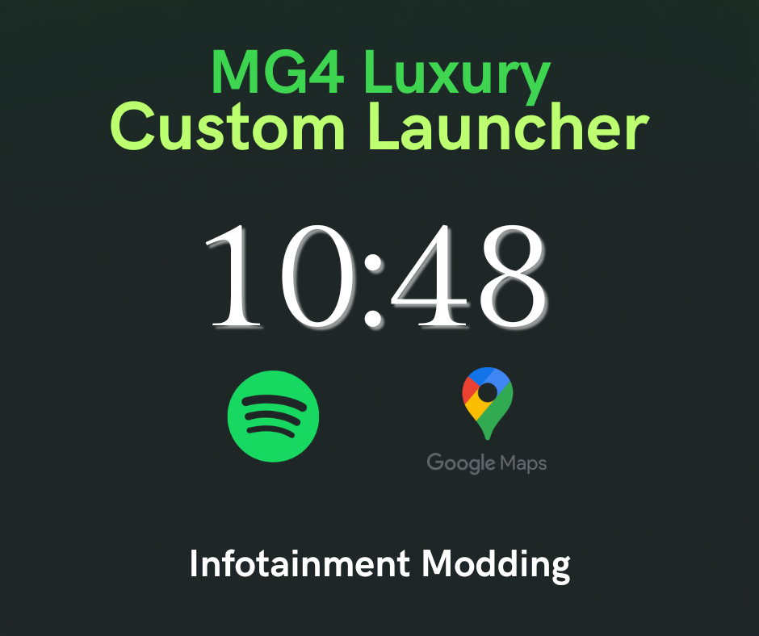

<p align="center">
  
</p>

# MG4 Luxury Custom Launcher

> Launcher Android personnalisé pour la **MG4 (Android 9 / API 28)**, remplaçant l'écran d'accueil natif SAIC.  
> Développé en **Java** avec Android Studio.

---

## Fonctionnalités

- **Horloge temps réel** sur l'écran d'accueil
- **Apps épinglées** — grille personnalisable, persistée entre les redémarrages
- **Favoris** — marquer et retrouver ses apps rapidement
- **Tiroir d'applications** avec recherche en temps réel
- **Bouton mute** — coupe l'alarme sonore de vitesse en un tap
- **Désinstallation** d'apps via long-press
- **Démarrage automatique** au boot de la voiture (`BOOT_COMPLETED`)

---

## Stack technique

| Outil | Version |
|-------|---------|
| Java | 21 |
| Gradle | 8.9 |
| Android (MG4) | API 28 (Android 9) |
| AGP | 8.5.0 |

---

## Installation

```bash
# Brancher la MG4 en USB et activer le débogage ADB
adb install -r app/build/outputs/apk/debug/app-debug.apk
```

Au prochain appui sur **Home**, sélectionner **MG4 Launcher** puis **Toujours**.

> Compatible également via **clé USB** (FAT32) ou **ADB over WiFi**.

